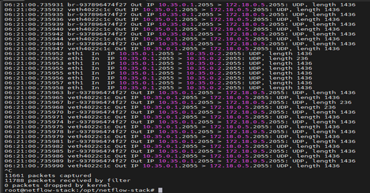

NetFlow Analytics Stack on Ubuntu 24.04 (Step-by-Step)
   
  
 
 
⚙️ Docker Components
1.	goflow2: Listens on UDP/2055, exports NetFlow/IPFIX to Kafka
2.	Kafka + Zookeeper: Message broker for flow messages
3.	netflow-consumer: Python service, parses Kafka topic and writes to InfluxDB
4.	InfluxDB 1.8: Time-series database
5.	Grafana: Visualization (external or local)
Briefs:
•	goflow2 — UDP/2055 collector that parses NetFlow v9/IPFIX and publishes JSON to Kafka (flow-messages).
•	Kafka + Zookeeper — message broker (single broker mode for simplicity).
•	netflow-consumer (Python) — subscribes to Kafka, converts records to Influx line protocol, writes to InfluxDB.
•	InfluxDB 1.8 — time-series storage for flows.
•	Grafana — dashboards (local or remote).
________________________________________
0)	Prep the host

              sudo apt update && sudo apt -y upgrade
			  sudo timedatectl set-timezone Asia/Dhaka   # optional

1)	If you use UFW:

			  sudo ufw allow 2055/udp         # NetFlow from router
			  sudo ufw allow 3000/tcp         # Grafana + Prometheus
			  sudo ufw allow 8086/tcp         # InfluxDB (optional; keep internal if possible)
			  sudo ufw enable

2)	Kernel buffers for heavy UDP:

			  echo 'net.core.rmem_default=26214400' | sudo tee -a /etc/sysctl.conf
			  echo 'net.core.rmem_max=33554432'     | sudo tee -a /etc/sysctl.conf
			  sudo sysctl –p

3)	   
	1. Install Docker Engine + Compose (official repo)

			  sudo apt -y install ca-certificates curl gnupg
			  sudo install -m 0755 -d /etc/apt/keyrings
			  curl -fsSL https://download.docker.com/linux/ubuntu/gpg \
			  | sudo gpg --dearmor -o /etc/apt/keyrings/docker.gpg
			  echo \
  	          "deb [arch=$(dpkg --print-architecture) signed-by=/etc/apt/keyrings/docker.gpg] \
			  https://download.docker.com/linux/ubuntu $(. /etc/os-release; echo $UBUNTU_CODENAME) stable" \
			  | sudo tee /etc/apt/sources.list.d/docker.list > /dev/null

			  sudo apt update
			  sudo apt -y install docker-ce docker-ce-cli containerd.io docker-buildx-plugin docker-compose-plugin
			  sudo systemctl enable --now docker
			  docker --version
			  docker compose version
			  
# Run Docker without sudo:
			  sudo usermod -aG docker $USER && newgrp docker

	2. Create project layout

			  sudo mkdir -p /opt/netflow-stack/python_consumer
			  sudo chown -R $USER:$USER /opt/netflow-stack
			  cd /opt/netflow-stack
			  
			  /opt/netflow-stack
			  ├─ docker-compose.yml
			  └─ python_consumer/
					├─ Dockerfile
					├─ requirements.txt
					└─ consumer.py
	
	3. Create docker-compose.yml
	
	 Create /opt/netflow-stack/docker-compose.yml with:
	
			version: "3.9"
			services:
			  zookeeper:
				image: confluentinc/cp-zookeeper:7.6.1
				environment:
				  ZOOKEEPER_CLIENT_PORT: 2181
				  ZOOKEEPER_TICK_TIME: 2000
				volumes:
				  - zookeeper-data:/var/lib/zookeeper/data
				  - zookeeper-log:/var/lib/zookeeper/log
				restart: unless-stopped

			  kafka:
				image: confluentinc/cp-kafka:7.6.1
				depends_on:
				  - zookeeper
				ports:
				  - "9092:9092"     # host access (debug/tools)
				environment:
				  KAFKA_BROKER_ID: 1
				  KAFKA_ZOOKEEPER_CONNECT: zookeeper:2181
				  KAFKA_LISTENER_SECURITY_PROTOCOL_MAP: PLAINTEXT:PLAINTEXT,PLAINTEXT_HOST:PLAINTEXT
				  KAFKA_ADVERTISED_LISTENERS: PLAINTEXT://kafka:29092,PLAINTEXT_HOST://localhost:9092
				  KAFKA_OFFSETS_TOPIC_REPLICATION_FACTOR: 1
				  KAFKA_TRANSACTION_STATE_LOG_MIN_ISR: 1
				  KAFKA_TRANSACTION_STATE_LOG_REPLICATION_FACTOR: 1
				volumes:
				  - kafka-data:/var/lib/kafka/data
				restart: unless-stopped
				
  # NOTE: Some environments publish the image as cloudflare/goflow (binary: /goflow2).
  # If you see an entrypoint error, switch to image: cloudflare/goflow and keep the same args.
			  goflow2:
				image: cloudflare/goflow
				command: >
				  /goflow2 -loglevel info
				  -transport udp
				  -listen :2055
				  -kafka.brokers kafka:29092
				  -kafka.topic flow-messages
				  -format json
				ports:
				  - "2055:2055/udp"
				depends_on:
				  - kafka
				restart: unless-stopped

			  influxdb:
				image: influxdb:1.8
				ports:
				  - "8086:8086"
				environment:
				  INFLUXDB_DB: netflow
				  INFLUXDB_HTTP_AUTH_ENABLED: "true"
				  INFLUXDB_ADMIN_USER: admin
				  INFLUXDB_ADMIN_PASSWORD: "StrongAdminPass#1"
				  INFLUXDB_USER: netflow
				  INFLUXDB_USER_PASSWORD: "Netflow#Pass1"
				volumes:
				  - influxdb-data:/var/lib/influxdb
				restart: unless-stopped

			  netflow-consumer:
				build: ./python_consumer
				environment:
				  KAFKA_BOOTSTRAP_SERVERS: kafka:29092
				  KAFKA_TOPIC: flow-messages
				  CONSUMER_GROUP: netflow-consumer
				  INFLUX_HOST: influxdb
				  INFLUX_PORT: 8086
				  INFLUX_DB: netflow
				  INFLUX_USER: netflow
				  INFLUX_PASSWORD: "Netflow#Pass1"
				depends_on:
				  - kafka
				  - influxdb
				restart: unless-stopped

			  grafana:
				image: grafana/grafana-oss:10.4.3
				ports:
				  - "3000:3000"
				environment:
				  GF_SECURITY_ADMIN_PASSWORD: "ChangeMe!Now"
				volumes:
				  - grafana-data:/var/lib/grafana
				depends_on:
				  - influxdb
				restart: unless-stopped

			volumes:
			  zookeeper-data:
			  zookeeper-log:
			  kafka-data:
			  influxdb-data:
			  grafana-data:

4) Python consumer files

python_consumer/requirements.txt

			kafka-python==2.0.2
			influxdb==5.3.1
			ujson==5.10.0
			python_consumer/Dockerfile
			FROM python:3.11-slim

			WORKDIR /app
			COPY requirements.txt .
			RUN pip install --no-cache-dir -r requirements.txt

			COPY consumer.py .
			CMD ["python", "/app/consumer.py"]

			python_consumer/consumer.py (robust, tolerant of missing keys)
			import json, os, time, ujson
			from kafka import KafkaConsumer
			from influxdb import InfluxDBClient

			KAFKA_BOOTSTRAP_SERVERS = os.getenv("KAFKA_BOOTSTRAP_SERVERS", "kafka:29092")
			KAFKA_TOPIC = os.getenv("KAFKA_TOPIC", "flow-messages")
			CONSUMER_GROUP = os.getenv("CONSUMER_GROUP", "netflow-consumer")

			INFLUX_HOST = os.getenv("INFLUX_HOST", "influxdb")
			INFLUX_PORT = int(os.getenv("INFLUX_PORT", "8086"))
			INFLUX_DB   = os.getenv("INFLUX_DB", "netflow")
			INFLUX_USER = os.getenv("INFLUX_USER", "netflow")
			INFLUX_PASS = os.getenv("INFLUX_PASSWORD", "netflow")

			def connect_influx():
				while True:
					try:
						c = InfluxDBClient(host=INFLUX_HOST, port=INFLUX_PORT,
										   username=INFLUX_USER, password=INFLUX_PASS,
										   timeout=10, retries=3)
						c.switch_database(INFLUX_DB)
						return c
					except Exception as e:
						print(f"[influx] connect failed: {e}; retrying in 3s")
						time.sleep(3)

			def connect_kafka():
				while True:
					try:
						return KafkaConsumer(
							KAFKA_TOPIC,
							bootstrap_servers=KAFKA_BOOTSTRAP_SERVERS.split(","),
							group_id=CONSUMER_GROUP,
							auto_offset_reset="latest",
							enable_auto_commit=True,
							max_poll_interval_ms=300000,
							consumer_timeout_ms=0,
							value_deserializer=lambda m: ujson.loads(m.decode("utf-8"))
						)
					except Exception as e:
						print(f"[kafka] connect failed: {e}; retrying in 3s")
						time.sleep(3)

			def to_point(flow):
				# goflow2 JSON often includes:
				# SrcAddr, DstAddr, SrcPort, DstPort, Proto, Bytes, Packets, InIf, OutIf, Start, End, SamplerAddress, EType, TCPFlags
				tags = {
					"src": flow.get("SrcAddr", ""),
					"dst": flow.get("DstAddr", ""),
					"sport": str(flow.get("SrcPort", "")),
					"dport": str(flow.get("DstPort", "")),
					"proto": str(flow.get("Proto", "")),
					"in_if": str(flow.get("InIf", "")),
					"out_if": str(flow.get("OutIf", "")),
					"sampler": flow.get("SamplerAddress", ""),
				}
				fields = {
					"bytes": int(flow.get("Bytes", 0)),
					"packets": int(flow.get("Packets", 0)),
					"tcp_flags": int(flow.get("TCPFlags", 0)),
					"etype": int(flow.get("EType", 0)),
				}
				# Measurement & point
				return {
					"measurement": "flows",
					"tags": {k:v for k,v in tags.items() if v != "" and v != "None"},
					"fields": fields
					# Let InfluxDB timestamp server-side; or add "time" with parsed flow["End"]
				}

			def main():
				influx = connect_influx()
				consumer = connect_kafka()

				batch = []
				BATCH_SIZE = 1000
				last_write = time.time()

				for msg in consumer:
					try:
						flow = msg.value
						point = to_point(flow)
						batch.append(point)

						if len(batch) >= BATCH_SIZE or (time.time() - last_write) > 2:
							influx.write_points(batch, time_precision="s", batch_size=BATCH_SIZE)
							batch.clear()
							last_write = time.time()
					except Exception as e:
						print(f"[consumer] error: {e}")
						time.sleep(0.5)

			if __name__ == "__main__":
				main()

5) Start the stack

cd /opt/netflow-stack
docker compose up -d
docker compose ps
 

6) Configure MikroTik exporter

On your MikroTik:

/ip traffic-flow set enabled=yes
/ip traffic-flow target add address=<collector_public_or_lan_ip> port=2055 version=9

Make sure your firewall/NAT lets UDP/2055 reach the server’s IP.

7) Verify flows are arriving
On the Ubuntu host:

# 1. Check flow packets from MikroTik

sudo tcpdump -i any port 2055 -n

You should see UDP packets from the router.
 
 
 
8) Check Kafka
List topics:
docker exec -it netflow-stack-kafka-1 kafka-topics --bootstrap-server localhost:9092 --list
# or inside the container using the service name
docker exec -it netflow-stack-kafka-1 kafka-topics --bootstrap-server kafka:29092 --list

Read a few messages:
docker exec -it netflow-stack-kafka-1 kafka-console-consumer \
  --bootstrap-server kafka:29092 \
  --topic flow-messages \
  --from-beginning \
  --max-messages 5

If empty, inspect:

docker compose logs goflow2 --tail=100

9) Check the Python consumer & InfluxDB
docker compose logs -f netflow-consumer

Confirm there are no write errors. (DB is pre-created via env.)
Test InfluxDB shell:
docker exec -it netflow-stack-influxdb-1 influx -execute 'SHOW DATABASES'
docker exec -it netflow-stack-influxdb-1 influx -database netflow -execute 'SHOW MEASUREMENTS'

10) Connect Grafana
https://grafana.maltixtech.xyz/login

 
Add InfluxDB datasource:
•	URL: http://influxdb:8086
•	Database: netflow
•	Auth: enable, user netflow, pass Netflow#Pass1
Create a dashboard (e.g., Panel → Query flows, field bytes, group by dst or src).
Live DNS Queries (QPS)
 
 
 
ISP CHECK graph under latency
 
 

11) Day-2 ops (handy commands)

# Status

docker compose ps
docker compose logs goflow2 --tail=50
docker compose logs netflow-consumer --tail=50

# Rebuild just the consumer

docker compose build netflow-consumer
docker compose up -d netflow-consumer

# Restart collector

docker compose restart goflow2

# Full restart

docker compose down
docker compose up -d

12) Security & hardening (quick hits)
•	Keep InfluxDB closed to the internet; expose only inside Docker network if possible.
•	Restrict inbound UDP/2055 on the host firewall to only your router’s IP.
•	Change all default passwords (Grafana admin, InfluxDB users).
•	Consider moving Kafka’s port 9092 to LAN/VPN only (tools can exec inside the container).
13) Backups
•	InfluxDB: snapshot the influxdb-data volume (stop container for consistent FS copy or use Influx backup tooling).
•	Grafana: backup grafana-data (dashboards, users).
•	Compose file & consumer code: keep in Git.

*These resources provided valuable insights, guidance, and support throughout the project lifecycle, enabling us to achieve our goals effectively.*

---

### 📧 **Connect with me:**

- **LinkedIn**: https://www.linkedin.com/in/mdmhoque/  

---

### 📢 **Stay Connected**

Certainly, Lucky! Here are some useful reference links for each major component in your NetFlow analytics stack. These will help you understand the architecture, configuration, and tuning tips — and can also be used for future troubleshooting or scaling.
________________________________________
🔹 1. goflow2 (NetFlow/IPFIX Collector)
•	GitHub:
🔗 https://github.com/cloudflare/goflow
•	Docker Image (Cloudflare):
🔗 https://hub.docker.com/r/cloudflare/goflow
•	Setup Example:
🔗 https://dev.to/midzer/netflow-with-cloudflare-goflow2-17hc
________________________________________
🔹 2. Apache Kafka (Confluent)
•	Kafka Overview:
🔗 https://kafka.apache.org/intro
•	Dockerized Kafka Setup (Confluent Platform):
🔗 https://docs.confluent.io/platform/current/quickstart/ce-docker-quickstart.html
•	Kafka Broker Tuning:
🔗 https://docs.confluent.io/platform/current/kafka/deployment/production.html
________________________________________
🔹 3. Python Kafka Consumer
•	kafka-python Docs:
🔗 https://kafka-python.readthedocs.io/en/master/
•	Consumer Example:
🔗 https://realpython.com/python-mqtt/#using-kafka-python
•	Reconnection Handling Example:
🔗 https://github.com/dpkp/kafka-python/issues/1791 (handling NoBrokersAvailable)
________________________________________
🔹 4. InfluxDB (v1.8)
•	InfluxDB Docs:
🔗 https://docs.influxdata.com/influxdb/v1.8/
•	Retention Policy:
🔗 https://docs.influxdata.com/influxdb/v1.8/query_language/database_management/#retention-policy-management
•	Downsampling with Continuous Queries:
🔗 https://docs.influxdata.com/influxdb/v1.8/query_language/continuous_queries/
________________________________________
🔹 5. Grafana + InfluxDB Integration
•	Grafana InfluxDB Setup:
🔗 https://grafana.com/docs/grafana/latest/datasources/influxdb/
•	NetFlow Dashboards (Community examples):
🔗 https://grafana.com/grafana/dashboards/?search=netflow
•	JSON Dashboard Import/Export:
🔗 https://grafana.com/docs/grafana/latest/dashboards/export-import/
________________________________________
🔹 6. MikroTik NetFlow Configuration
•	MikroTik Wiki (Traffic Flow):
🔗 https://wiki.mikrotik.com/wiki/Manual:IP/Traffic_Flow
•	Sample Setup:
🔗 https://blog.apnic.net/2022/09/07/using-netflow-from-mikrotik-with-grafana/
________________________________________
🛠️ Bonus – System Tuning for High NetFlow Load
•	Linux UDP Buffer Tuning:
🔗 https://www.kernel.org/doc/Documentation/networking/ip-sysctl.txt
•	Kafka Performance Tips:
🔗 https://www.confluent.io/blog/kafka-fastest-messaging-system/

